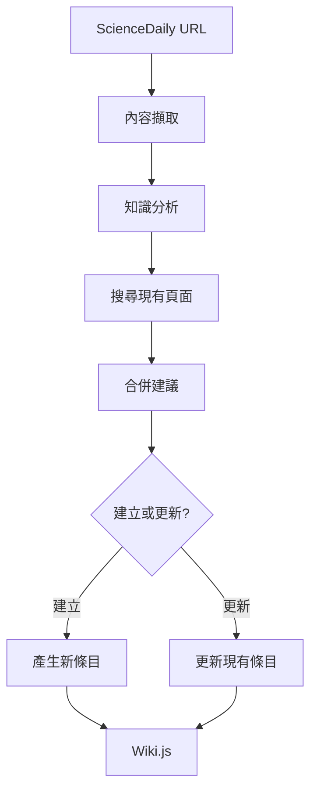

# 使用範例

## 命令列使用

### 預覽分析

```bash
python cli.py --preview https://www.sciencedaily.com/releases/2025/03/250324181544.htm
```

### 建立主條目

```bash
python cli.py --create --main-only https://www.sciencedaily.com/releases/2025/03/250324181544.htm
```

### 建立完整條目結構

```bash
python cli.py --create https://www.sciencedaily.com/releases/2025/03/250324181544.htm
```

## Python API 使用

```python
from src.langchain2wikijs import ScienceDaily2WikiService

# 初始化服務
service = ScienceDaily2WikiService()

# 預覽分析
url = "https://www.sciencedaily.com/releases/2025/03/250324181544.htm"
preview = service.preview_analysis(url)

if preview["success"]:
    print(f"標題: {preview['article_info']['title']}")
    print(f"主題: {preview['analysis']['main_topic']}")
    
    # 建立 Wiki 條目
    result = service.process_sciencedaily_url(url, main_entry_only=True)
    
    if result["success"]:
        print(f"建立了 {len(result['created_pages'])} 個頁面")
```

## 設定說明

### config.json

```json
{
    "wiki.js": {
        "graphql_url": "https://your-wiki.domain/graphql",
        "api": "your_jwt_token_here"
    }
}
```

### .env（可選，用於 LangChain 功能）

```bash
OPENAI_API_KEY=your_openai_api_key_here
```

## 功能特性

### 已實作功能

1. **內容擷取**: 從 ScienceDaily URL 擷取文章資訊
2. **基礎分析**: 即使沒有 OpenAI API 也能運作
3. **Wiki 建立**: 建立結構化的 Wiki.js 條目
4. **內容更新**: 智慧更新現有條目
5. **搜尋整合**: 搜尋相關現有頁面
6. **引用格式**: 自動產生 APA 格式引用
7. **模組化設計**: 遵循 SOLID 原則

### LangChain 增強功能（需要 OpenAI API）

1. **智慧分析**: 深度分析文章結構
2. **概念擷取**: 自動識別關鍵概念
3. **方法識別**: 擷取技術方法和工具
4. **應用分析**: 識別應用場景
5. **合併建議**: 智慧建議條目合併
6. **內容產生**: 高品質的 Markdown 內容

## 工作流程



## 輸出範例

### 產生的 Wiki 條目格式

```markdown
# 機器學習在醫學診斷中的應用

## 概述

研究展示了人工智慧在醫學診斷中的應用...

## 詳細資訊

人工智慧技術，特別是深度學習，在醫學影像分析中顯示出巨大潛力...

## 來源資訊

- **來源**: ScienceDaily
- **發佈日期**: 2024-01-01
- **原文連結**: https://www.sciencedaily.com/...

## References

ScienceDaily. (2024-01-01). *機器學習在醫學診斷中的應用*. Retrieved from https://www.sciencedaily.com/...
```

## 疑難排解

### 常見問題

1. **匯入錯誤**: 確認在專案根目錄執行
2. **設定錯誤**: 檢查 config.json 格式與內容
3. **網路問題**: 確認能存取 ScienceDaily 與 Wiki.js
4. **權限問題**: 確認 Wiki.js API 權杖有建立/編輯權限

### 除錯模式

```bash
# 啟用詳細輸出
export LANGCHAIN_VERBOSE=true
python cli.py --preview <url>
```

## 擴充開發

### 新增內容來源

1. 建立新的擷取器類別（如 `ArxivExtractor`）
2. 實作相同的介面方法
3. 在主服務中整合

### 支援其他 Wiki 平台

1. 實作新的客戶端類別（如 `MediaWikiClient`）
2. 保持相同的介面
3. 在服務類中替換客戶端

### 自訂內容處理

1. 繼承 `KnowledgeProcessor` 類別
2. 覆寫內容產生方法
3. 注入自訂處理器
