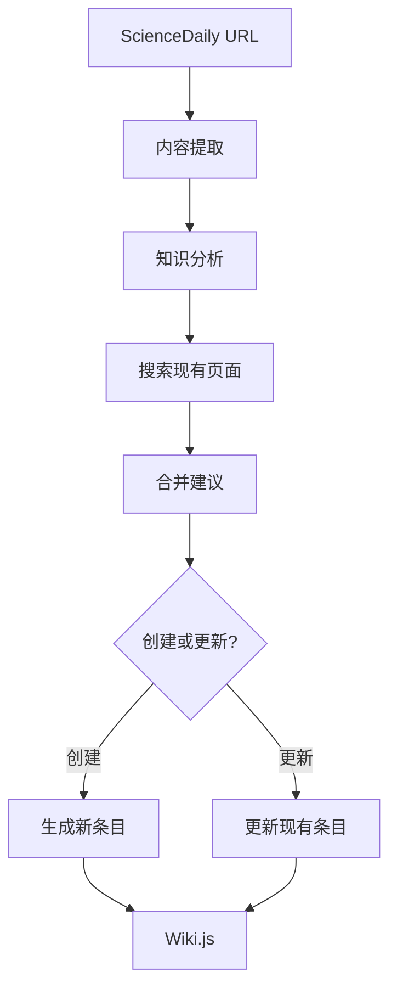

# 使用示例

## 命令行使用

### 预览分析

```bash
python cli.py --preview https://www.sciencedaily.com/releases/2025/03/250324181544.htm
```

### 创建主条目

```bash
python cli.py --create --main-only https://www.sciencedaily.com/releases/2025/03/250324181544.htm
```

### 创建完整条目结构

```bash
python cli.py --create https://www.sciencedaily.com/releases/2025/03/250324181544.htm
```

## Python API 使用

```python
from src.langchain2wikijs import ScienceDaily2WikiService

# 初始化服务
service = ScienceDaily2WikiService()

# 预览分析
url = "https://www.sciencedaily.com/releases/2025/03/250324181544.htm"
preview = service.preview_analysis(url)

if preview["success"]:
    print(f"标题: {preview['article_info']['title']}")
    print(f"主题: {preview['analysis']['main_topic']}")
    
    # 创建 Wiki 条目
    result = service.process_sciencedaily_url(url, main_entry_only=True)
    
    if result["success"]:
        print(f"创建了 {len(result['created_pages'])} 个页面")
```

## 配置说明

### config.json

```json
{
    "wiki.js": {
        "graphql_url": "https://your-wiki.domain/graphql",
        "api": "your_jwt_token_here"
    }
}
```

### .env (可选，用于 LangChain 功能)

```bash
OPENAI_API_KEY=your_openai_api_key_here
```

## 功能特性

### ✅ 已实现功能

1. **内容提取**: 从 ScienceDaily URL 提取文章信息
2. **基础分析**: 即使没有 OpenAI API 也能工作
3. **Wiki 创建**: 创建结构化的 Wiki.js 条目
4. **内容更新**: 智能更新现有条目
5. **搜索集成**: 搜索相关现有页面
6. **引用格式**: 自动生成 APA 格式引用
7. **模块化设计**: 遵循 SOLID 原则

### 🔧 LangChain 增强功能 (需要 OpenAI API)

1. **智能分析**: 深度分析文章结构
2. **概念提取**: 自动识别关键概念
3. **方法识别**: 提取技术方法和工具
4. **应用分析**: 识别应用场景
5. **合并建议**: 智能建议条目合并
6. **内容生成**: 高质量的 Markdown 内容

## 工作流程



## 输出示例

### 生成的 Wiki 条目格式

```markdown
# 机器学习在医学诊断中的应用

## 概述

研究展示了人工智能在医学诊断中的应用...

## 详细信息

人工智能技术，特别是深度学习，在医学影像分析中显示出巨大潜力...

## 来源信息

- **来源**: ScienceDaily
- **发布日期**: 2024-01-01
- **原文链接**: https://www.sciencedaily.com/...

## References

ScienceDaily. (2024-01-01). *机器学习在医学诊断中的应用*. Retrieved from https://www.sciencedaily.com/...
```

## 故障排除

### 常见问题

1. **导入错误**: 确保在项目根目录运行
2. **配置错误**: 检查 config.json 格式和内容
3. **网络问题**: 确保能访问 ScienceDaily 和 Wiki.js
4. **权限问题**: 确保 Wiki.js API 令牌有创建/编辑权限

### 除錯模式

```bash
# 啟用詳細輸出
export LANGCHAIN_VERBOSE=true
python cli.py --preview <url>
```

## 擴充開發

### 新增內容來源

1. 建立新的提取器類別 (如 `ArxivExtractor`)
2. 實作相同的介面方法
3. 在主服務中整合

### 支援其他 Wiki 平台

1. 實作新的客戶端類別 (如 `MediaWikiClient`)
2. 保持相同的介面
3. 在服務類中替換客戶端

### 自訂內容處理

1. 繼承 `KnowledgeProcessor` 類別
2. 覆寫內容產生方法
3. 注入自訂處理器
